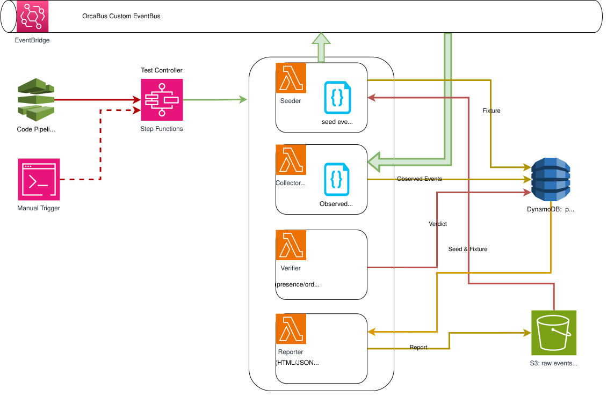

platform-integration-tests
================================================================================

- [platform-integration-tests](#platform-integration-tests)
  - [Service Description](#service-description)
    - [Responsibility](#responsibility)
    - [Architecture](#architecture)
    - [System Component](#system-component)
    - [CI/CD Integration](#cicd-integration)
  - [Infrastructure \& Deployment](#infrastructure--deployment)
    - [Stateful](#stateful)
    - [Stateless](#stateless)
    - [CDK Commands](#cdk-commands)
    - [Stacks](#stacks)
  - [Development](#development)
    - [Project Structure](#project-structure)
    - [Setup](#setup)
      - [Requirements](#requirements)
      - [Install Dependencies](#install-dependencies)
      - [First Steps](#first-steps)
    - [Linting \& Formatting](#linting--formatting)
    - [Testing](#testing)
  - [Glossary \& References](#glossary--references)


Service Description
--------------------------------------------------------------------------------

## Responsibility

**Staging guardrail for OrcaBus** — a fast, deterministic integration-testing system that exercises **real orchestration** on the OrcaBus **staging EventBridge bus** without running expensive external workloads. It seeds scenarios, collects emitted events, verifies them against golden fixtures, and emits a single **pass/fail verdict** to gate production in CI/CD.

## Architecture




**Key points**
- Exactly **one Lambda per role**: `Seeder`, `Collector`, `Verifier`, `Reporter`, and `RuleController`.
- A **Step Functions controller** orchestrates the entire test run: enables the collector rule, seeds events, waits for collection, verifies results, reports, and disables the collector rule. It **does not** read or write DynamoDB or S3 directly.
- A **single DynamoDB table** stores **everything** per run: **run metadata**, **observed events**, and the **final verdict**.
- Test runs are identified by **testInstrumentRunId** (format: `YYMMDD_A00001_XXXX_TESTXXXXXX`), which is automatically generated by the Seeder.


### high levelArchitecture

1. CI/CD deploys OrcaBus to **staging**.
2. CI/CD triggers the **test controller** (AWS Step Functions).
3. The controller:
   - **Enables the Collector EventBridge rule** via the **RuleController Lambda**.
   - Generates a unique `testInstrumentRunId` and seeds a scenario via the **Seeder Lambda**.
   - Collects all test-mode events via the **Collector Lambda** (triggered by EventBridge).
   - Waits until all expected events arrive or a timeout occurs (polling via **Verifier** in status mode).
   - Invokes the **Verifier Lambda** (verify mode) to compute a verdict.
   - Invokes the **Reporter Lambda** to publish a report.
   - **Disables the Collector EventBridge rule** via the **RuleController Lambda**.
4. CI/CD reads the verdict and **allows or blocks promotion to production**.

### AWS Services

- **AWS Step Functions**
  - Orchestrates a single integration test run end-to-end.
  - Does **not** access DynamoDB or S3 directly; all logic is in Lambdas.

- **AWS Lambda** (Python)
  - `RuleController` – enables/disables the EventBridge collector rule at the start and end of test runs.
  - `Seeder` – uses a **service registry** to dynamically invoke service-specific seed logic (e.g. `SequenceRunManagerService`). Generates test instrument run IDs, loads seed fixtures from S3, creates run metadata, and publishes test events to EventBridge. Supports `serviceName: "all"` to run all registered services.
  - `Collector` – triggered by EventBridge, archives test-mode events to S3 and writes event metadata to DynamoDB.
  - `Verifier` – uses the same **service registry** to delegate status checks and verification to service-specific classes. Compares expected events (from S3) vs. observed events (from DynamoDB) and writes verdict.
  - `Reporter` – generates an HTML report for single or multiple services and stores it in S3. Supports `serviceName: "all"` and nested `verifyResult` keyed by service name.


- **Amazon DynamoDB**
  - **Single table** that stores:
    - Run metadata (keyed by `testId=run#{testInstrumentRunId}`, `sk=run#meta`)
    - Observed events (keyed by `testId=run#{testInstrumentRunId}`, `sk=event#{timestamp}`)
    - Missing expected events (keyed by `testId=run#{testInstrumentRunId}`, `sk=event#{order}-missing` or `expectation#{order}-missing`)
    - Final verdict (stored in run metadata)

- **Amazon S3**
  - Stores seed fixtures (`seed/services/{serviceName}/seeds.json` and `expectations.json`).
  - Stores full event payloads (`events/testruns/{testInstrumentRunId}/year=YYYY/month=MM/day=DD/...`).
  - Stores HTML reports (`reports/testruns/{serviceName}/year=YYYY/month=MM/day=DD/...`).

## System Component

1. **Test Controller (Step Functions)**
   On trigger (from **CodePipeline** or manual):
   - **EnableCollectorRule** – enables the EventBridge rule via **RuleController Lambda**.
   - **SeedScenario** – invokes **Seeder Lambda** to generate testInstrumentRunId and publish test events.
   - **Wait/Status Loop** – polls **Verifier Lambda** (status mode) until run is **ready** (all expected events seen) or **timeout**.
   - **VerifyRun** – invokes **Verifier Lambda** (verify mode) to compute verdict.
   - **ReportRun** – invokes **Reporter Lambda** to generate HTML report.
   - **DisableCollectorRule** – disables the EventBridge rule via **RuleController Lambda**.

2. **RuleController (Lambda, Python)**
   Enables or disables the EventBridge collector rule. Called at the start and end of each test run to control when the Collector Lambda receives events.

3. **Seeder (Lambda, Python)**
   Uses a **service registry** (`app/services/service_registry.py`) to map `serviceName` to service classes (e.g. `SequenceRunManagerService`). Each service implements `execute_seed_process()`. For `serviceName: "all"`, seeds all registered services; otherwise seeds the requested service. Generates unique test instrument run IDs, loads seed fixtures from S3, creates run metadata in DynamoDB, and publishes test events to EventBridge with dynamic field replacement (`__replace` configuration).

4. **Collector (Lambda, Python)**
   Triggered by EventBridge when the collector rule is enabled. Extracts `instrumentRunId` from events, verifies run metadata exists, archives full events to S3, and writes event metadata to DynamoDB. Ignores seed events from specific sources.

5. **Verifier (Lambda, Python)**
   Uses the same **service registry** to delegate to service classes. Each service implements `execute_check_run_status_process()` and `execute_verify_process()`. Runs in two modes:
   - **Status mode**: Checks if all expected events have been observed (called repeatedly during wait loop).
   - **Verify mode**: Loads expectations from S3, matches observed events from DynamoDB using `__match.fields` rules, and writes verdict to DynamoDB.

6. **Reporter (Lambda, Python)**
   Reads the verdict from DynamoDB (and `verifyResult` from Step Functions), builds an **HTML report** and stores it in **S3**. Supports `serviceName: "all"` (aggregate report) or a specific service. CI can consume the verdict to approve/block promotion.

## CI/CD Integration

Typical CodePipeline flow:

1. **Build & unit tests**
2. **Deploy OrcaBus to staging**
3. **Run integration harness** (this system)
   - Action calls the Step Functions controller with:
     - `scenario` (or multiple scenarios)
   - Waits for the SFN execution to finish.
4. **Decision**
   - If `verdict = "passed"`:
     - Proceed to production deploy.
   - If `verdict = "failed"`:
     - Fail the pipeline or require manual approval.
5. **Deploy to production (after manual approve)**


Infrastructure & Deployment
--------------------------------------------------------------------------------

Infrastructure and deployment are managed via CDK. The system uses AWS CDK to provision all required resources including Lambda functions, Step Functions state machines, DynamoDB tables, S3 buckets, and EventBridge rules. This template provides two types of CDK entry points: `cdk-stateless` and `cdk-stateful`.


### Stateful

Stateful resources that persist data across deployments:

- **DynamoDB table** (`platform-it-store`): Stores run metadata, fixtures, observed events, and verdicts
- **S3 buckets** (`platform-it-store`): Stores full event payloads and test reports

### Stateless
Stateless resources that can be redeployed without side effects:

- **Lambda functions**: `Seeder`, `Collector`, `Verifier`, and `Reporter`
- **Step Functions state machine**: Orchestrates the test execution workflow
- **EventBridge rules**: Routes test-mode events to the Collector


### CDK Commands

You can access CDK commands using the `pnpm` wrapper script.

- **`cdk-stateless`**: Used to deploy stacks containing stateless resources (e.g., AWS Lambda), which can be easily redeployed without side effects.
- **`cdk-stateful`**: Used to deploy stacks containing stateful resources (e.g., AWS DynamoDB, AWS RDS), where redeployment may not be ideal due to potential side effects.

The type of stack to deploy is determined by the context set in the `./bin/deploy.ts` file. This ensures the correct stack is executed based on the provided context.

For example:

```sh
# Deploy a stateless stack
pnpm cdk-stateless <command>

# Deploy a stateful stack
pnpm cdk-stateful <command>
```

### Stacks

This CDK project manages multiple stacks. The root stack (the only one that does not include `DeploymentPipeline` in its stack ID) is deployed in the toolchain account and sets up a CodePipeline for cross-environment deployments to `beta`, `gamma`, and `prod`.

To list all available stateful stacks, run:

```sh
pnpm cdk-stateful ls
```

Example output:

```sh
StatefulPlatformItStorageStack
StatefulPlatformItStorageStack/DeploymentPipeline/OrcaBusGamma/StatefulPlatformItStorageStack (OrcaBusGamma-StatefulPlatformItStorageStack)
```

To build the CICD pipeline for Integration Testing stateful service
```sh
pnpm cdk-stateful synth -e StatefulPlatformItStorageStack
pnpm cdk-stateful diff -e StatefulPlatformItStorageStack
pnpm cdk-stateful deploy -e StatefulPlatformItStorageStack
```

To build (test) in the stg account
```sh
pnpm cdk-stateful synth -e StatefulPlatformItStorageStack/DeploymentPipeline/OrcaBusGamma/StatefulPlatformItStorageStack
pnpm cdk-stateful diff -e StatefulPlatformItStorageStack/DeploymentPipeline/OrcaBusGamma/StatefulPlatformItStorageStack
pnpm cdk-stateful deploy -e StatefulPlatformItStorageStack/DeploymentPipeline/OrcaBusGamma/StatefulPlatformItStorageStack
```


To list all available stateless stacks, run:

```sh
pnpm cdk-stateless ls
```

Example output:

```sh
StatelessPlatformItHarnessStack
StatelessPlatformItHarnessStack/DeploymentPipeline/OrcaBusGamma/StatelessPlatformItHarnessStack (OrcaBusGamma-StatelessPlatformItHarnessStack)
```

To build the CICD pipeline for Integration Testing stateless service
```sh
pnpm cdk-stateless synth -e StatelessPlatformItHarnessStack
pnpm cdk-stateless diff -e StatelessPlatformItHarnessStack
pnpm cdk-stateless deploy -e StatelessPlatformItHarnessStack
```

To build (test) in the gamma account
```sh
pnpm cdk-stateless synth -e StatelessPlatformItHarnessStack/DeploymentPipeline/OrcaBusGamma/StatelessPlatformItHarnessStack
pnpm cdk-stateless diff -e StatelessPlatformItHarnessStack/DeploymentPipeline/OrcaBusGamma/StatelessPlatformItHarnessStack
pnpm cdk-stateless deploy -e StatelessPlatformItHarnessStack/DeploymentPipeline/OrcaBusGamma/StatelessPlatformItHarnessStack
```

Development
--------------------------------------------------------------------------------

### Project Structure

The root of the project is an AWS CDK project where the main application logic lives inside the `./app` folder.

The project is organized into the following key directories:

- **`./app`**: Contains the main application logic. You can open the code editor directly in this folder, and the application should run independently.

- **`./bin/deploy.ts`**: Serves as the entry point of the application. It initializes two root stacks: `stateless` and `stateful`. You can remove one of these if your service does not require it.

- **`./infrastructure`**: Contains the infrastructure code for the project:
  - **`./infrastructure/toolchain`**: Includes stacks for the stateless and stateful resources deployed in the toolchain account. These stacks primarily set up the CodePipeline for cross-environment deployments.
  - **`./infrastructure/stage`**: Defines the stage stacks for different environments:
    - **`./infrastructure/stage/config.ts`**: Contains environment-specific configuration files (e.g., `beta`, `gamma`, `prod`).
    - **`./infrastructure/stage/stack.ts`**: The CDK stack entry point for provisioning resources required by the application in `./app`.

- **`.github/workflows/pr-tests.yml`**: Configures GitHub Actions to run tests for `make check` (linting and code style), tests defined in `./test`, and `make test` for the `./app` directory. Modify this file as needed to ensure the tests are properly configured for your environment.

- **`./test`**: Contains tests for CDK code compliance against `cdk-nag`. You should modify these test files to match the resources defined in the `./infrastructure` folder.


### Setup

#### Requirements

```sh
node --version
v22.9.0

# Update Corepack (if necessary, as per pnpm documentation)
npm install --global corepack@latest

# Enable Corepack to use pnpm
corepack enable pnpm

```

#### Install Dependencies

To install all required dependencies, run:

```sh
make install
```

#### First Steps

Before using this template, search for all instances of `TODO:` comments in the codebase and update them as appropriate for your service. This includes replacing placeholder values (such as stack names).


### Linting & Formatting

Automated checks are enforced via pre-commit hooks, ensuring only checked code is committed. For details consult the `.pre-commit-config.yaml` file.

Manual, on-demand checking is also available via `make` targets (see below). For details consult the `Makefile` in the root of the project.


To run linting and formatting checks on the root project, use:

```sh
make check
```

To automatically fix issues with ESLint and Prettier, run:

```sh
make fix
```

### Testing


Unit tests are available for most of the business logic. Test code is hosted alongside business logic in `./test` directories.

```sh
make test
```

Glossary & References
--------------------------------------------------------------------------------

For general terms and expressions used across OrcaBus services, please see the platform [documentation](https://github.com/OrcaBus/wiki/blob/main/orcabus-platform/README.md#glossary--references).

Service specific terms:

| Term      | Description                                      |
|-----------|--------------------------------------------------|
| `testInstrumentRunId`  | Unique identifier for a test execution run (format: `YYMMDD_A00001_XXXX_TESTXXXXXX`, e.g., `260122_A00001_1234_TEST123456`) |
| `testId` | DynamoDB partition key format: `run#{testInstrumentRunId}` |
| Expectation | Expected event data from `expectations.json` that defines what should be observed during a test run |
| Verdict | The pass/fail status and reasons for a test run |
| `__replace` | Configuration in seed events for dynamic field replacement (randomUniqueIdField, testInstrumentRunIdField, timeStampField) |
| `__match.fields` | Configuration in expectations that specifies which fields to match when verifying observed events |
| Service registry | Central mapping (`app/services/service_registry.py`) of service names to service classes. Add a new service by implementing `BaseService` and registering it in `SERVICE_REGISTRY`. |
